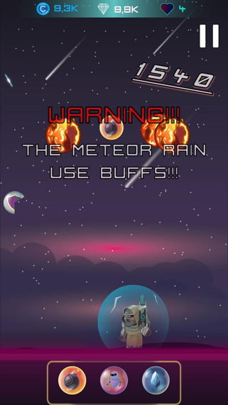
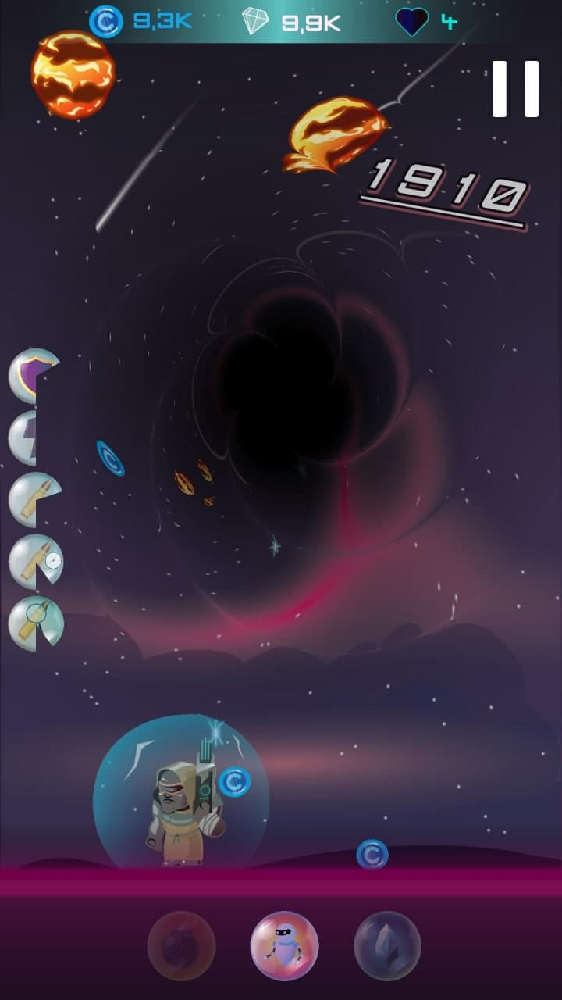

# CyberCrashers

## Description

Public version of the project. The presence of only scripts (not all).
For security reasons, the data on commits has been removed. The project was uploaded with one commit.

Used Unity 3d
C#

Commit values : 263 

## Getting Started
You can play this game by following the link below
https://play.google.com/store/apps/details?id=com.CyberCrasher

## Authors

* **Andrii Bondarenko** - [PraydE](https://github.com/PraydE007)
* **Oleksandr Stanislavskyy** - [Zemerr](https://github.com/Zemerr)
* **Mykhailo Dovbnia** - [Sonhokko](https://github.com/Sonhokko)
* **Yuriy Stanislavskyy** - [yurastanik](https://github.com/yurastanik)

## License

* This project is licensed under the MIT License - see the [LICENSE.md](LICENSE.md) file for details

## Screenshots

